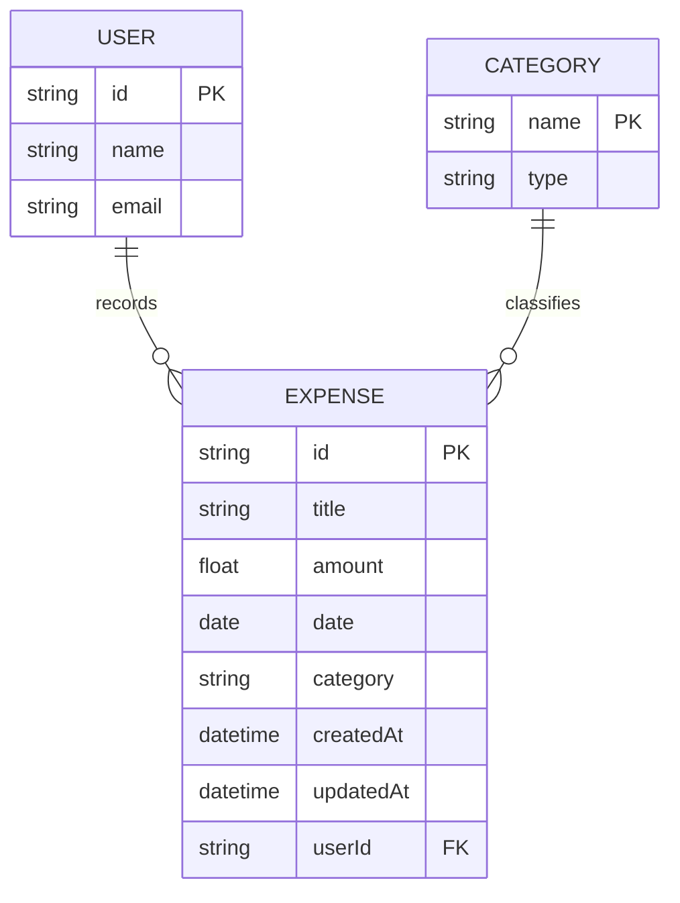

## ER Diagram

```mermaid
erDiagram
	USER {
		string id PK
		string name
		string email
	}

	EXPENSE {
		string id PK
		string title
		float amount
		date date
		string category
		datetime createdAt
		datetime updatedAt
		string userId FK
	}

	CATEGORY {
		string name PK
		string type
	}

	USER ||--o{ EXPENSE : records
	CATEGORY ||--o{ EXPENSE : classifies
```

Note: MVP is single-user, but keeping a `USER` entity in the ER model makes phase-2 authentication expansion straightforward.

Legacy image reference:

