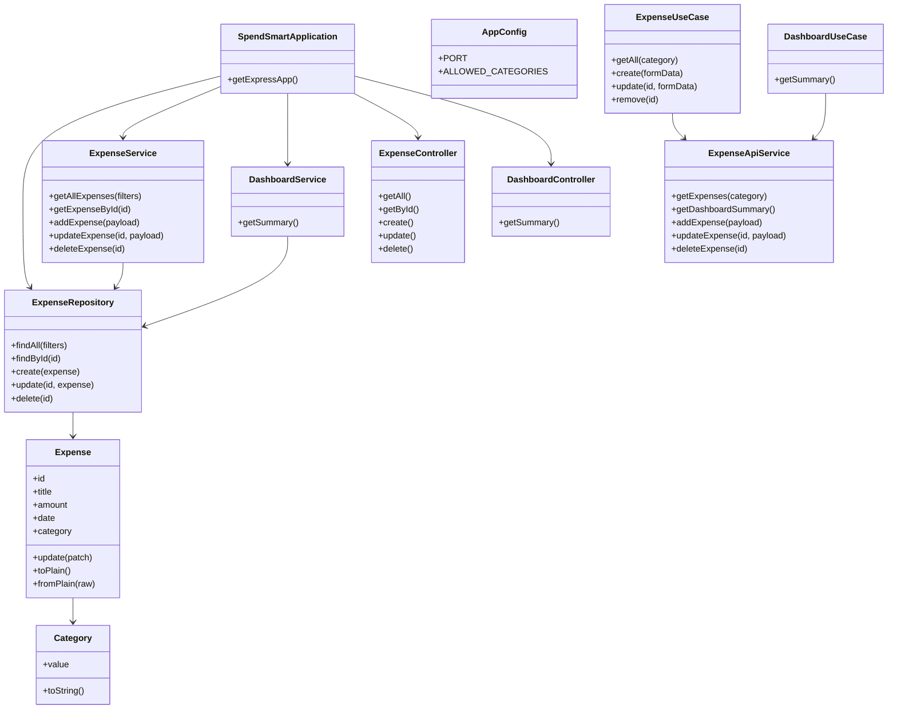
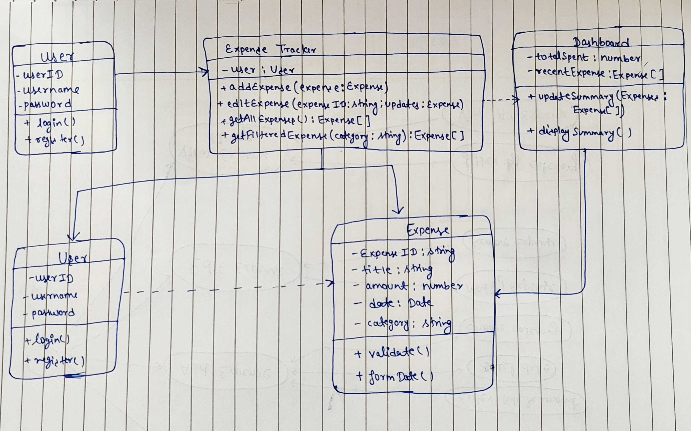

## Class Diagram

```mermaid
classDiagram
	class SpendSmartApplication {
		+getExpressApp()
	}

	class AppConfig {
		+PORT
		+ALLOWED_CATEGORIES
	}

	class Expense {
		+id
		+title
		+amount
		+date
		+category
		+update(patch)
		+toPlain()
		+fromPlain(raw)
	}

	class Category {
		+value
		+toString()
	}

	class ExpenseRepository {
		+findAll(filters)
		+findById(id)
		+create(expense)
		+update(id, expense)
		+delete(id)
	}

	class ExpenseService {
		+getAllExpenses(filters)
		+getExpenseById(id)
		+addExpense(payload)
		+updateExpense(id, payload)
		+deleteExpense(id)
	}

	class DashboardService {
		+getSummary()
	}

	class ExpenseController {
		+getAll()
		+getById()
		+create()
		+update()
		+delete()
	}

	class DashboardController {
		+getSummary()
	}

	class ExpenseApiService {
		+getExpenses(category)
		+getDashboardSummary()
		+addExpense(payload)
		+updateExpense(id, payload)
		+deleteExpense(id)
	}

	class ExpenseUseCase {
		+getAll(category)
		+create(formData)
		+update(id, formData)
		+remove(id)
	}

	class DashboardUseCase {
		+getSummary()
	}

	SpendSmartApplication --> ExpenseRepository
	SpendSmartApplication --> ExpenseService
	SpendSmartApplication --> DashboardService
	SpendSmartApplication --> ExpenseController
	SpendSmartApplication --> DashboardController

	ExpenseService --> ExpenseRepository
	DashboardService --> ExpenseRepository
	ExpenseRepository --> Expense
	Expense --> Category

	ExpenseUseCase --> ExpenseApiService
	DashboardUseCase --> ExpenseApiService
```

Legacy image reference:

