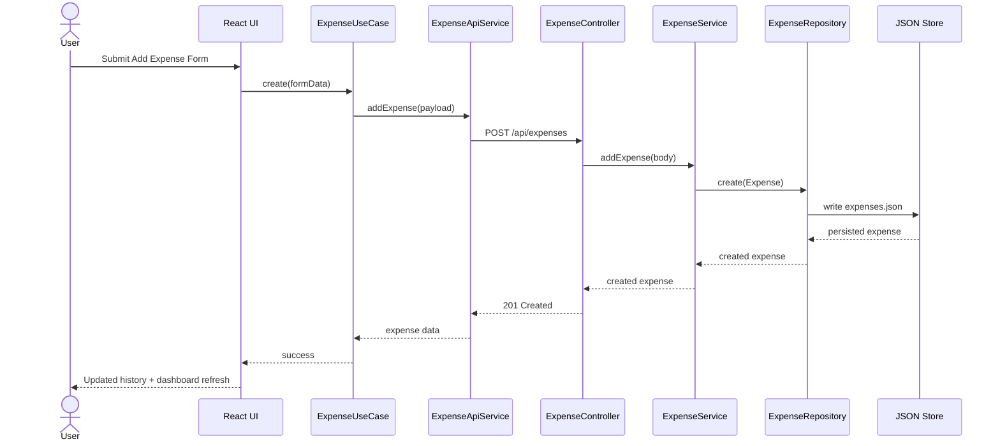

## Sequence Diagram

```mermaid
sequenceDiagram
	actor User
	participant UI as React UI
	participant EU as ExpenseUseCase
	participant API as ExpenseApiService
	participant EC as ExpenseController
	participant ES as ExpenseService
	participant ER as ExpenseRepository
	participant DB as JSON Store

	User->>UI: Submit Add Expense Form
	UI->>EU: create(formData)
	EU->>API: addExpense(payload)
	API->>EC: POST /api/expenses
	EC->>ES: addExpense(body)
	ES->>ER: create(Expense)
	ER->>DB: write expenses.json
	DB-->>ER: persisted expense
	ER-->>ES: created expense
	ES-->>EC: created expense
	EC-->>API: 201 Created
	API-->>EU: expense data
	EU-->>UI: success
	UI-->>User: Updated history + dashboard refresh
```

Legacy image reference:

