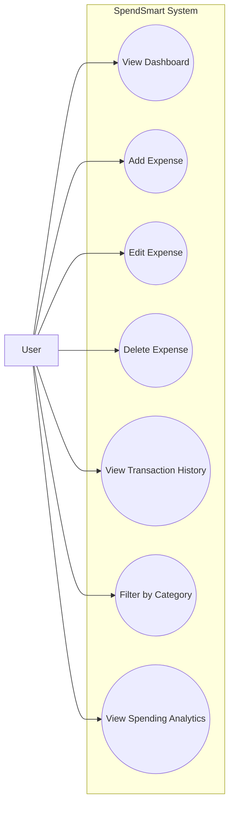

## Use Case Diagram

```mermaid
flowchart LR
	U[User]

	subgraph SpendSmart System
		UC1((View Dashboard))
		UC2((Add Expense))
		UC3((Edit Expense))
		UC4((Delete Expense))
		UC5((View Transaction History))
		UC6((Filter by Category))
		UC7((View Spending Analytics))
	end

	U --> UC1
	U --> UC2
	U --> UC3
	U --> UC4
	U --> UC5
	U --> UC6
	U --> UC7
```

Legacy image reference:

